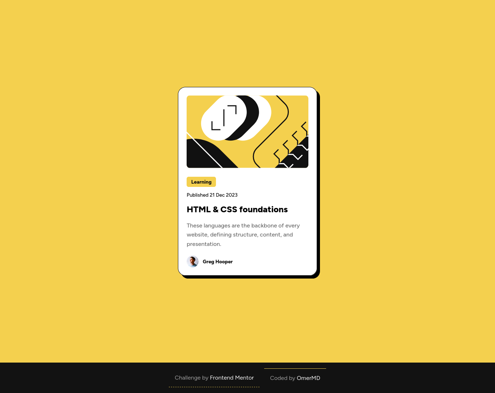

# Frontend Mentor - Blog preview card solution


## Table of contents

- [The challenge](#the-challenge)
- [Snapshots](#snapshots)
- [Links](#links)
- [Built with](#built-with)
- [What I learned?](#what-i-learned?)
- [Thougts](#thoughts)
- [Author](#author)


## The challenge

Replicate thiso  -> [Blog preview card challenge on Frontend Mentor](https://www.frontendmentor.io/challenges/blog-preview-card-ckPaj01IcS)

Users should be able to:

- See hover and focus states for all interactive elements on the page

## Snapshots

Desktop Version



Mobile Version


### Links

- Solution URL: [Solution](https://github.com/MaskeyDude/blog-preview-card_frontendo)
- Live Site URL: [Live](https://maskeydude.github.io/blog-preview-card_frontendo/)

### Built with

- HTML
- CSS Grid

### What I learned?

I already knew this but it was forgotton as I didn't use it as much. After downloading the font you'll have a .ttf file so just:

```css
@font-face {
    font-family: "FontName";
    src: url(./fonts/font-name_wght.ttf);
}```

Then you can use the font yay!

```css
p {
  font-family: "FontName", sans-serif;
}
```

+ that I really like using live server when coding but it overheats my laptop TnT

## Thoughts

Well I guess I'll need to make a read.md file tempelate for myself as it's getting um... yeah I don't wanna leave it empty just cuz I got too lazy to fill it all

## Author

- Website - [OmerM](https://www.omerm.42web.io/index.html?i=1)
- Frontend Mentor - [@MaskeyDude](https://www.frontendmentor.io/profile/MaskeyDude)